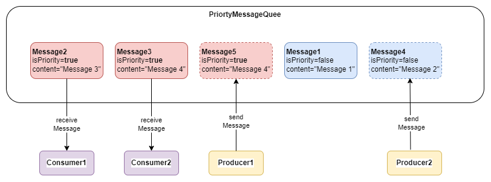

# Student ToDo:
1. Erstellen Sie einen fork von diesem Repository
2. Dieser fork sollte private sein
3. Fügen Sie in ihrem fork bzw. Repository die Lehrenden unter `Settings --> Collaborators` mit Lese- und Schreibrechten hinzu
4. Implementieren Sie das nachfolgende Beispiel und commiten Sie dieses in Ihr Repository
5. Pushen Sie Ihre Änderungen auf Ihr Repository

## Änderungen in den eigenen Fork mergen (nur wenn nötig!)
Fügen Sie zunächst dieses Repository (das der Organisation) als weiteres remote Repository hinzu (Name: `upstream`)
```bash
git remote add upstream https://itsp.htl-leoben.at/git/%organisation%/%exercise-name%.git
```
Remote repository herunterladen
```bash
git fetch upstream
```
Merge durchführen
```bash
git merge upstream/master master -m "merge changes from upstream"
```

# Priority Message Queue

Es soll mit Hilfe von `wait()` und `notifyAll(`), eine Message Queue erstellt werden, in der Nachrichten von `Producer` erzeugt werden und `Consumer`, diese Nachrichten aus der `MessqgeQueue` holen. Das Abholen der Messages soll generell nach dem **FIFO** Prinzip erfolgen. Eine `Message` besteht aus einem Prirority-Flag und dem eigentlichen Content (String). Messages, bei denen das Priority Flag auf `true` gesetzt ist, sollen vorgereiht werden - wobei auch für Priority Nachrichten das **FIFO** Prinzip angewandt wreden soll.



Es soll die Möglichkeit geben, die **maximale Anzahl** der verwalteten Messages in der Queue zu definieren!

Um die Implementierung ordentlich testen zu können sollen die Procucer in zufälligen Zeitabständen Nachrichten an die Queue senden und Consumer in zufälligen Zeitabständen, Nachrichten von der Queue abrufen (= empfangen).

> :warning: **Beachte:** Ist die maximale Anzahl an Nachrichten in der Queue erreicht, so darf solange kein Producer Nachrichten an die Queue senden, solange nicht ein Cosumer eine Nachricht aus der Queue entegen nimmt. Ist die Message Queue hingegen leer, so müssen alle Consumer solange warten, bis Nachrichten von Producer wieder in die Queue gestellt werden.

## Klassen

```java

class Message {
    boolean isPriority = false;
    String content;

    // Constructor, getter, setter 
}

class Producer extends Thread {

    // Producer name
    private String name;

    // Constructor, getter, setter

    // Produce at random time Messages
}

class Consumer extends Thread {

    // Consumer name
    private String name;

    // Constructor, getter, setter

    // Consume at random time messgaes
}

class PriortyMessageQueue {

    // necessary Constructor

    // necessary class variables
    public synchronized void sendMessge(Message msg) {
        // implementation
    }

    public synchronized Message receiveMessage() {
        // implementation
    }
}
```

## Möglicher Programmablauf

```console
Procducer1 sendMessage(): Message Content1
Produccer2 sendMessage(true): Message Content2
Consumer1 receiveMessage(): true, MessageContent2
Consumer2 receiveMessage(): false, MessageContent1
Consomer1 receiveMessage(): WAIT
...
```